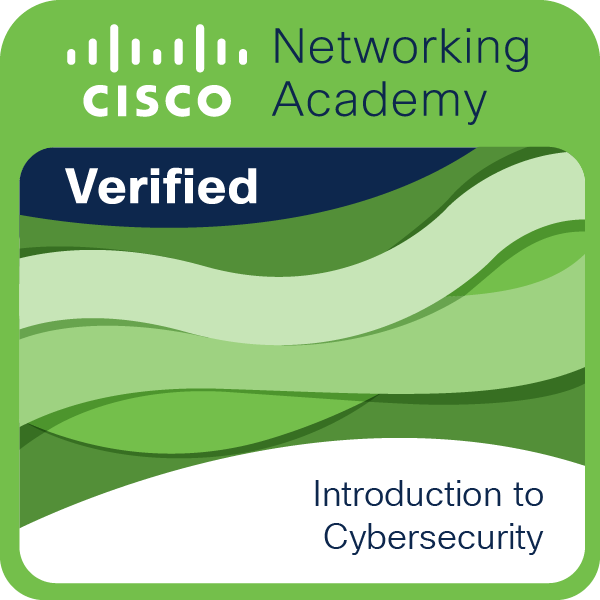

<h1 align="center">⚡ Mohammad | MSZ Studio ⚡</h1>

<h3 align="center">
🚀 AI Engineer • Cybersecurity Enthusiast • Backend Developer • System Builder
</h3>

<p align="center">

</p>

---

# 🌌 About Me

```bash
> Name: Mohammad
> Company: MSZ Studio
> Focus: AI / Cybersecurity / Automation / APIs
> Stack: Node.js + Python + PostgreSQL
> Goal: Building Powerful Systems
```

---

# 🧠 Core Technologies

<p align="center">


</p>

---

# ⚡ Tech Stack

## 💻 Languages


---

## ⚙️ Backend Development


---

## 🗄️ Databases


---

# 🔐 Cybersecurity

<p align="center">


</p>

---

# 🤖 AI & Automation

<p align="center">


</p>

---

# 🧩 Binary Engineering

```txt
01001101 01010011 01011010
SYSTEMS • NETWORKS • AI • AUTOMATION
```

---

# 🏆 Certifications & Badges

## IBM Artificial Intelligence Fundamentals

<p align="center">

</p>

---

## Cisco Introduction to Cybersecurity

<p align="center">

</p>

---

# 📊 GitHub Statistics

<p align="center">


</p>

---

# 🔥 Contribution Streak

<p align="center">


</p>

---

# 📈 Activity Graph

<p align="center">


</p>

---

# 🧠 Current Focus

- 🤖 Artificial Intelligence
- 🛡️ Cybersecurity
- ⚡ Backend Systems
- 🔥 Automation Tools
- 🌐 API Development
- 📡 Networking

---

# 🚀 Featured Projects

## 🤖 AI Systems
- AI Bots
- Automation Tools
- Smart APIs

## 🛡️ Cybersecurity
- Security Testing
- Recon Tools
- API Security

## 🌐 Backend Engineering
- Discord Bots
- Subscription Systems
- REST APIs

---

# 🌍 Connect With Me

<p align="center">

<a href="https://github.com/YOUR_USERNAME">

</a>

<a href="https://discord.com">

</a>

</p>

---

# 👁️ Profile Views

<p align="center">


</p>

---

# ⚔️ MSZ Studio

```txt
██████╗ ███╗   ███╗███████╗
██╔══██╗████╗ ████║╚══███╔╝
██████╔╝██╔████╔██║  ███╔╝
██╔══██╗██║╚██╔╝██║ ███╔╝
██║  ██║██║ ╚═╝ ██║███████╗
╚═╝  ╚═╝╚═╝     ╚═╝╚══════╝
```

<h3 align="center">
⚡ Building The Future With Code ⚡
</h3>


